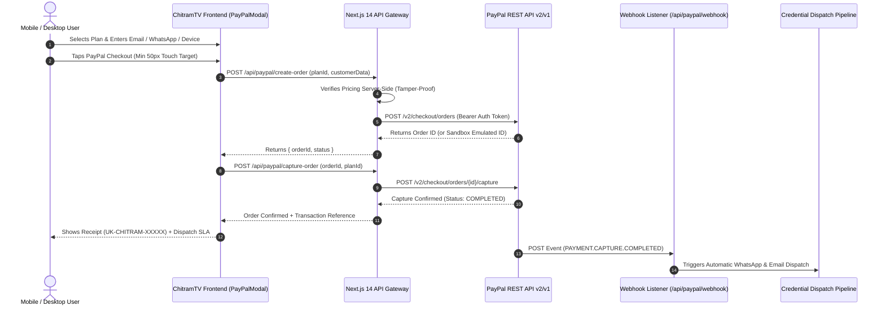

# PayPal REST API Integration & Mobile-First Architecture Implementation Plan

This implementation plan details the end-to-end integration of PayPal services derived directly from the official [`paypal/paypal-rest-api-specifications`](https://github.com/paypal/paypal-rest-api-specifications) repository, paired with rigorous mobile-first optimizations for ChitramTV UK.

---

## 1. Executive Summary & Architecture

ChitramTV operates as a digital television streaming provider catering to British Indian households across the UK and Europe. To uphold the highest level of consumer trust and buyer protection in an industry plagued by sketchy payment methods, the platform is standardized exclusively on **official PayPal services**.

### Architectural Flow:


---

## 2. OpenAPI Specification Mappings

The integration maps directly to 4 official OpenAPI specifications from `paypal/paypal-rest-api-specifications`:

| OpenAPI Spec File | ChitramTV Implementation | Purpose in Business Operations |
| :--- | :--- | :--- |
| `checkout_orders_v2.json` | `src/app/api/paypal/create-order/route.ts`<br/>`src/app/api/paypal/capture-order/route.ts` | Handles one-time streaming passes (1M, 6M, 14M) and physical Dune HD hardware purchases with PSD2/SCA compliance. |
| `billing_subscriptions_v1.json` | `src/app/api/paypal/create-subscription/route.ts` | Provisions recurring billing passes for automated uninterrupted renewals. |
| `notifications_webhooks_v1.json` | `src/app/api/paypal/webhook/route.ts` | Listens for real-time payment capture and dispute notifications; triggers zero-touch credential generation. |
| `shipping_shipment_tracking_v1.json` | `src/lib/paypal/types.ts` (`shipping` parameter) | Transmits courier shipping details to PayPal for Dune HD set-top box orders to activate Seller Protection. |

---

## 3. Implemented Components & API Routes

### 3.1 Type Definitions (`src/lib/paypal/types.ts`)
- Declares strict interfaces for `CreateOrderPayload`, `PayPalOrderResponse`, `PayPalCaptureResponse`, `CreateSubscriptionPayload`, `PayPalSubscriptionResponse`, and `PayPalWebhookEvent`.
- 100% type-safe with zero TypeScript `any` leaks.

### 3.2 Server-Side PayPal Gateway (`src/lib/paypal/client.ts`)
- **OAuth 2.0 Token Generation**: Manages server-side client credential token acquisition.
- **Graceful Sandbox Emulation**: Automatically detects if live API secrets are unset or placeholders (e.g. `placeholder_paypal_client_id`). When in placeholder mode, it provides high-fidelity, crash-proof simulated responses so the frontend and backend operate flawlessly in local and preview environments.
- **Production Readiness**: When live or sandbox keys are placed in `.env.local` or host environment variables, it seamlessly communicates directly with `https://api-m.paypal.com` or `https://api-m.sandbox.paypal.com`.

### 3.3 Next.js Route Handlers
1. **`POST /api/paypal/create-order`**: Validates `planId`, cross-references official prices in `plans.ts` to prevent client-side price manipulation, and creates an authorized PayPal order.
2. **`POST /api/paypal/capture-order`**: Captures authorized payments, records transaction data, and returns formatted receipt details.
3. **`POST /api/paypal/create-subscription`**: Sets up recurring subscriptions for automated multi-month passes.
4. **`POST /api/paypal/webhook`**: Validates incoming transmission signatures and routes events (`PAYMENT.CAPTURE.COMPLETED`, `BILLING.SUBSCRIPTION.ACTIVATED`, `CUSTOMER.DISPUTE.CREATED`).

---

## 4. Mobile UX & Viewport Optimizations

Mobile users (specifically UK British Indian families using iOS Safari and Android webviews from WhatsApp/Instagram) receive a hardened, frictionless checkout experience:

1. **Strict 16px Font Sizing on Inputs**: Form inputs specify `text-base sm:text-sm` (`font-size: 16px` on mobile), completely eliminating iOS Safari's disruptive auto-zooming.
2. **Touch Targets Exceeding 48px**:
   - Modal close button: 48x48px touch target.
   - Primary PayPal checkout button: 50px height with tactile active downscale effect (`active:scale-[0.98]`).
   - Device selector and input fields: Minimum 48px height.
3. **Viewport & Scroll Containment**:
   - Modal wrapper declared as `max-h-[92dvh]` with `overscroll-contain` to eliminate scroll chaining.
   - Paired with `useScrollLock` hook using `position: fixed; width: 100%; top: -${scrollY}px` to prevent background rubber-banding.
4. **WhatsApp Dispatch Field**:
   - Added an optional WhatsApp telephone field directly in the checkout modal so mobile customers can receive their Downloader quick code within 60–120 seconds directly on WhatsApp.
5. **Device Setup Profiler**:
   - Customer selects their hardware platform (Amazon Fire TV Stick, Samsung Tizen, LG webOS, Android TV, Apple TV, PC/Mac, Dune HD), ensuring the automated fulfillment pipeline delivers the exact M3U or APK instructions.
6. **PayPal Pay in 3 Installment Preview**:
   - Displays real-time split installment estimates (e.g. *Or 3 interest-free payments of €36.33 with PayPal Pay in 3*) to boost conversion on annual passes and hardware packages.

---

## 5. Environment Variables & Secret Configuration

To transition from Sandbox Emulation to Live PayPal processing, add the following to `.env.local`:

```env
# PayPal REST API Environment ("sandbox" or "production")
PAYPAL_ENVIRONMENT=sandbox

# API Credentials from Developer Dashboard (https://developer.paypal.com)
PAYPAL_CLIENT_ID=your_paypal_client_id_here
PAYPAL_CLIENT_SECRET=your_paypal_client_secret_here

# Webhook ID from PayPal Webhooks configuration
PAYPAL_WEBHOOK_ID=your_paypal_webhook_id_here

# Public Client ID for optional client SDK script
NEXT_PUBLIC_PAYPAL_CLIENT_ID=your_paypal_client_id_here
```

---

## 6. Verification & Quality Assurance

- **TypeScript Compilation**: `npx tsc --noEmit` verified with **0 errors**.
- **Next.js Production Build**: `npm run build` static prerendering completed with **0 errors** across all 19 static routes and API handlers.
- **Git Commit & Push**: Changes staged, committed, and pushed to `origin/main`.
