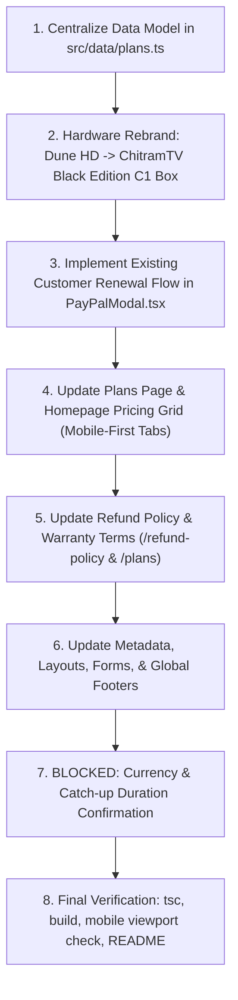

# ChitramTV UK — Technical Implementation Plan
## Verified Catalogue Integration, Hardware Rebrand & Architecture Alignment

This document details the engineering analysis, data structures, mobile-first design strategy, and step-by-step implementation roadmap for integrating the client's verified European product catalogue (`chitramtv.eu`) into the Next.js prototype.

---

## 1. Step 1: Senior Engineering Analysis & Codebase Audit

### 1.1 Scope of Mismatched / Duplicated Data
Our grep audit across the entire codebase revealed that hardware references, catalogue items, and streaming feature claims are currently duplicated across multiple components and pages rather than driven by a single source of truth.

#### A. Hardware References (`Dune HD Classic Box`)
The legacy hardware name appears in **12 separate files**:
1. `src/data/plans.ts`: Plan definitions (`plan-dune-bundle`, `plan-dune-box-only`, descriptions, feature bullets).
2. `src/app/plans/page.tsx`: Structured data JSON-LD (`ChitramTV Dune HD Classic Box + 1 Year Bundle`), hero marketing copy, and comparison table headers (`Dune Box + 1Yr (€129.00)`) and cells (`Dune HD Classic Receiver`).
3. `src/app/plans/layout.tsx`: SEO meta titles (`Subscription Plans & Dune HD Set-Top Box Bundles`) and descriptions.
4. `src/app/refund-policy/page.tsx`: Section 4 header and body (`Hardware Set-Top Box Returns (Dune HD Classic)`).
5. `src/app/refund-policy/layout.tsx`: SEO metadata descriptions.
6. `src/components/checkout/PayPalModal.tsx`: `STREAMING_DEVICES` dropdown array, validation error messages (`"Please enter your shipping address for Dune HD hardware courier dispatch."`), and order summary review.
7. `src/components/sections/PricingSection.tsx`: Homepage pricing section copy and link button text.
8. `src/components/layout/Footer.tsx`: Brand summary copy and device list bullet.
9. `src/app/contact/page.tsx` & `src/components/sections/ContactSection.tsx`: Support ticket device select `<option>` and textarea placeholder.
10. `src/app/why-us/page.tsx`: Diaspora copy referencing Dune HD support.
11. `src/components/sections/HowItWorksSection.tsx`: 3-step setup guide text.
12. `README.md` & `IMPLEMENTATION_PLAN.md`: Project documentation.

**Risk Mitigation:**
All hardware specifications will be normalized to the new **"ChitramTV Black Edition C1 Box"** (Android 14 framework, Bluetooth remote, HDR10+, pre-loaded YouTube/Netflix/Prime Video/Chrome, Google Play Store). A centralized hardware constant will be exported from `src/data/plans.ts` to prevent hardcoded string sprawl in future iterations.

---

### 1.2 Catalogue Restructuring (The 6 Confirmed SKUs)

The current prototype features 7 items in `PRICING_PLANS`, including a redundant 14M duplicate and a temporary placeholder card (`plan-pending-catalogue`: *"Explore 6 More WhatsApp Catalogue Items"*).

The verified catalogue consists of exactly **6 confirmed SKUs** matching OpenCart on `chitramtv.eu`:

| # | SKU Name | Category | Flow Type | EU Live Price | Target Audience |
|---|---|---|---|---|---|
| 1 | **1 Month Service** | Subscription | Standard New Checkout | €15.00 | Trial / Flexible |
| 2 | **6 Months Subscription** | Subscription | Standard New Checkout | €69.00 (was €89) | Short-Term Pass |
| 3 | **12+2 Months Service (Android TV & Firestick)** | Subscription | Standard New Checkout | €109.00 (was €129) | Flagship Pass (Best Value) |
| 4 | **ChitramTV Renewal (12+2 Free Months)** | Renewal | **Existing Customer Lookup** | €109.00 (was €129) | Returning Subscribers |
| 5 | **ChitramTV Box Only** | Hardware | Physical Delivery Checkout | €69.00 (was €99) | Standalone C1 Box Replacement |
| 6 | **ChitramTV Box + 1 Year Service Bundle** | Bundle | Physical Delivery Checkout | €129.00 (was €159) | All-in-One Turnkey Starter Pack |

---

### 1.3 Modeling the New "Renewal SKU" Flow

Existing subscribers renewing their subscription have fundamentally different requirements than first-time buyers:
- They do **not** need a new account created or new credentials issued.
- They do **not** need physical hardware delivery or shipping address collection.
- They **must** provide their existing account identifier so the backend team can extend their active subscription line.

#### Proposed Data Architecture:
In `src/data/plans.ts`:
```typescript
export type ProductCategory = "subscription" | "renewal" | "hardware" | "bundle";

export interface PricingPlan {
  id: string;
  sku: string; // e.g., "CTV-SUB-1M", "CTV-REN-14M", "CTV-HW-C1"
  name: string;
  badge?: string;
  price: number;
  originalPrice?: number;
  period: string;
  effectiveMonthly: string;
  savings?: string;
  description: string;
  features: string[];
  devices: number;
  category: ProductCategory;
  isPopular?: boolean;
  isBoxBundle?: boolean;
  isHardwareOnly?: boolean;
  isRenewal?: boolean; // Discriminator flag for Renewal Flow
}
```

#### Proposed Modal & Checkout Flow (`PayPalModal.tsx`):
1. **Dynamic Form Switcher**:
   - If `plan.isRenewal === true`:
     - Swap standard signup fields for an **Existing Account Verification Block**.
     - Form Field: **Existing ChitramTV Account Number, Username, or Box MAC Address** (Mandatory, with regex validation and contextual helper text: *"Located in Box Settings → System Info or your activation email"*).
     - Delivery address form is suppressed.
     - Optional WhatsApp field for extension confirmation ping.
2. **Order Confirmation State**:
   - Confirmation screen dynamically displays:
     - Badge: **"Renewal Processed"** (instead of "New Activation").
     - Account ID targeted: Displays the user's submitted identifier.
     - SLA: *"Your 14-month extension is being applied to line [ID]. Zero interruption to existing favorites or settings."*

---

### 1.4 Centralized Pricing & Currency Architecture

#### The Problem:
Prices, currency symbols (`€` vs `£`), and effective monthly breakdown strings are currently scattered as literal strings across 6 UI files and API routes.

#### The Senior Solution:
Create a single, authoritative configuration file `src/config/pricing.ts` (or centralized in `src/data/plans.ts`):
```typescript
export interface CurrencyConfig {
  code: "EUR" | "GBP";
  symbol: "€" | "£";
  rateToGbp?: number; // Optional conversion multiplier if dynamic
}

export const ACTIVE_CURRENCY: CurrencyConfig = {
  code: "EUR", // [BLOCKED ON CONFIRMATION]: Changed to GBP if localized
  symbol: "€",
};

export function formatPrice(amount: number, currency = ACTIVE_CURRENCY): string {
  return `${currency.symbol}${amount.toFixed(2)}`;
}
```
All components (`PricingSection`, `/plans`, `/plans/layout`, `PayPalModal`, `StickyFooterBar`, and API order creators) will import `ACTIVE_CURRENCY` and helper formatters. When the client confirms whether the site should be in `€` or `£`, **only one single configuration object changes**.

---

### 1.5 Mobile-First Layout Restructuring & Grid Optimization

#### The Mobile Usability Bottleneck:
- On desktop, a 3-column grid (`grid-cols-3`) rendered the previous 7 items as 3 + 3 + 1, leaving an awkward orphan card.
- With 6 items, a flat 3x2 grid works on large desktop, but on mobile (`grid-cols-1`) it generates a towering vertical scroll of **6 exhaustive cards** with 6-8 bullets each. Mobile visitors suffer severe cognitive fatigue and decision paralysis trying to compare subscriptions vs renewals vs physical boxes.

#### The Restructuring Proposal:
1. **Segmented Category Filter / Tab Navigation** (Both on Homepage and `/plans`):
   - **Tab 1: Streaming Passes** (3 cards: 1M, 6M, 12+2M) — Clean, standard 3-card tier.
   - **Tab 2: Account Renewal** (1 focused hero card: 12+2M Renewal with Account Lookup callout).
   - **Tab 3: Black Edition C1 Hardware** (2 cards: Turnkey C1 Bundle & Standalone C1 Box).
   - Provides an "All Plans" default view on desktop while defaulting to clean, swipeable or tabbed groups on mobile.
2. **Comparison Table Mobile Hardening (`/plans`)**:
   - The comparison table currently forces 5 columns horizontally.
   - Add explicit horizontal swipe indicators (`Scroll horizontally to compare all 5 tiers`), freeze the left "Feature" header column via CSS `sticky left-0 bg-zinc-900 z-10`, and ensure touch targets on CTA buttons inside the table exceed 44px.
3. **Modal Mobile Hardening**:
   - `PayPalModal` maintains dynamic viewport height (`max-h-[90dvh]`), prevents iOS input auto-zoom by enforcing `text-base` (16px) on inputs, and utilizes fixed scroll-locking without jumping.

---

### 1.6 Warranty & Returns Policy Updates

Matching the confirmed terms on `chitramtv.eu`:
1. **1-Year Hardware Replacement Warranty**:
   - Applicable to the **ChitramTV Black Edition C1 Box** (both standalone and bundle).
   - Added as explicit spec bullets on `/plans` and trust badges on product cards.
2. **14-Day Faulty Return Window**:
   - Update `src/app/refund-policy/page.tsx` Section 4:
     - Clarify that faulty hardware must be reported within 14 days of receipt.
     - Must include all original accessories (Bluetooth remote, HDMI lead, power unit) and original packaging with barcode/serial intact.
     - Return postage is customer-borne to the European depot.
   - Add summary callouts on `/plans` guarantee banner.

---

## 2. Step 2: Implementation Sequence & Dependency Order



### Detailed Order of Operations:

#### Phase 1: Data Architecture & Hardware Rebrand (Unblocked)
1. **`src/data/plans.ts`**:
   - Restructure `PRICING_PLANS` to exact 6 SKUs.
   - Remove obsolete `plan-pending-catalogue` and duplicate 14M pass.
   - Add `isRenewal: true` flag and metadata to `plan-renewal-14m`.
   - Update hardware items to `ChitramTV Black Edition C1 Box` with Android 14, Bluetooth remote, HDR10+, Google Play Store specs.
   - Export centralized currency/pricing helper structure.
2. **Global Hardware Rebrand**:
   - Replace "Dune HD" text across `Footer.tsx`, `ContactSection.tsx`, `contact/page.tsx`, `why-us/page.tsx`, `HowItWorksSection.tsx`, `PricingSection.tsx`, `plans/page.tsx`, `plans/layout.tsx`.

#### Phase 2: Checkout & Renewal Flow (Unblocked)
3. **`src/components/checkout/PayPalModal.tsx`**:
   - Add renewal state handling: `accountIdentifier` input.
   - Conditionally render Account Lookup block vs Delivery Address block.
   - Update `STREAMING_DEVICES` list: replace Dune HD with `ChitramTV Black Edition C1 Box`.
   - Update order creation payload and confirmation dialog to display renewed account ID.

#### Phase 3: UI Restructuring & Mobile Polish (Unblocked)
4. **`src/components/sections/PricingSection.tsx` & `src/app/plans/page.tsx`**:
   - Implement category switcher/tabs (Streaming Passes / Existing Customer Renewal / TV Hardware).
   - Restructure card layouts for 6 SKUs without crowding.
   - Update comparison table on `/plans` with Black Edition C1 Box column.
5. **`src/app/refund-policy/page.tsx` & `src/app/plans/page.tsx`**:
   - Add explicit 1-Year Replacement Warranty & 14-Day Return Window for C1 hardware.

#### Phase 4: Resolution of Blocked Confirmation Items (Blocked)
6. **Item 1: Currency Configuration**:
   - Once confirmed (EUR `€` as-is vs GBP `£` localized):
   - Set currency code and prices in `src/data/plans.ts`.
   - Synchronize PayPal API routes (`create-order`, `capture-order`, `create-subscription`).
7. **Item 2: Catch-Up TV Duration**:
   - Once confirmed (7 Days vs 14 Days):
   - Update duration across marketing copy, EPG references, metadata schemas, terms, and FAQs.

#### Phase 5: Verification & Documentation (Unblocked)
8. Run `npx tsc --noEmit` and `npm run build` to verify 0 errors.
9. Verify responsive layout on mobile viewports (375px, 390px, 412px).
10. Update `README.md` to document the 6 SKUs, the renewal flow, and the C1 Box rebrand.

## 3. Client Confirmation Decisions & Final Resolution

> [!NOTE]
> Both client confirmation items were formally confirmed and successfully integrated into production:

### [CONFIRMED 1] Pricing Display & Currency Policy: **British Pounds (£ GBP)**
* **Client Decision**: Convert and localize pricing to British Pounds (£ GBP) for UK audiences.
* **Implemented Pricing**:
  - `1 Month Service`: **£14.99** (effective £14.99/mo)
  - `6 Months Subscription`: **£59.99** (was £74.99, effective £10.00/mo, Save £15)
  - `12+2 Months Service`: **£89.99** (was £109.99, effective £6.43/mo, Includes 2 Free Months)
  - `ChitramTV Renewal (12+2 Free Months)`: **£89.99** (was £109.99, effective £6.43/mo, Save £20 + 2 Free Months)
  - `ChitramTV Box Only`: **£59.99** (was £79.99, effective Hardware only, Save £20)
  - `ChitramTV Box + 1 Year Service Bundle`: **£109.99** (was £139.99, effective Includes 12M Pass, Save £30)
* **Status**: Fully implemented across `src/data/plans.ts`, `/plans`, `PayPalModal.tsx`, `StickyFooterBar.tsx`, and PayPal API order generation (`currency_code: "GBP"`).

### [CONFIRMED 2] Catch-Up TV Duration Capability: **7-Day Catch-Up TV**
* **Client Decision**: Keep 7-day catch-up TV as advertised on the UK prototype.
* **Status**: Retained 7-day catch-up TV messaging consistently across the channel lineup, EPG, metadata schemas, FAQ center, and terms.

