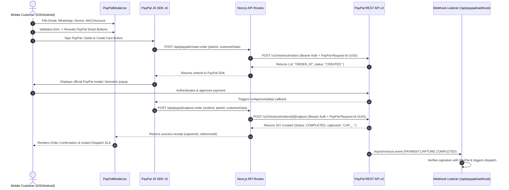

# PayPal REST API Production Fix & Mobile-First Implementation Plan

**File Path**: `implementation/PAYPAL_PRODUCTION_FIX_PLAN.md`  
**System**: ChitramTV UK Streaming Client  
**Author**: Antigravity AI Assistant  
**Date**: October 2026  
**Objective**: Eliminate all structural, cryptographic, and lifecycle flaws in the PayPal payment integration, guarantee zero runtime errors, and provide a hardened, responsive mobile checkout experience optimized for UK British Indian households across iOS, Android, and webviews.

---

## 1. Executive Summary & Flow Redesign

### Current Flawed Sequence (Fatal Defect)
In the existing codebase, submitting the checkout form in `PayPalModal.tsx` calls `/api/paypal/create-order` and immediately executes `/api/paypal/capture-order` in the very next statement without buyer approval:
```
[User taps Pay] ──> [Server creates order] ──> [Server attempts capture] ──> ❌ 422 ORDER_NOT_APPROVED
```
This fails in live production because PayPal requires the customer to authenticate, select payment method, and confirm the transaction before funds can be captured.

### New Zero-Flaw Standard Sequence
Using official PayPal Smart Payment Buttons inside the mobile modal:


---

## 2. Comprehensive Flaw Resolution Blueprint

### Fix 1: True Buyer Approval with PayPal SDK Buttons
- **Component**: `src/components/checkout/PayPalModal.tsx`
- **Implementation**:
  - Dynamically load the official PayPal JavaScript SDK:
    `https://www.paypal.com/sdk/js?client-id=${CLIENT_ID}&currency=GBP&components=buttons`
  - In mock/development mode (when keys are unset), render a realistic interactive emulator that simulates the PayPal approval popup before triggering capture.
  - In configured mode, render `window.paypal.Buttons`:
    - `createOrder`: Passes collected form data to `/api/paypal/create-order`.
    - `onApprove`: Receives `data.orderID` and sends it to `/api/paypal/capture-order`.
    - `onError`: Captures and displays actionable user guidance.
    - `onCancel`: Cleans up loading state gracefully.

### Fix 2: Mutating Call Idempotency (`PayPal-Request-Id`)
- **Component**: `src/lib/paypal/client.ts`
- **Implementation**:
  - Add `crypto.randomUUID()` generation to `createPayPalOrder` and `capturePayPalOrder`.
  - Pass header: `PayPal-Request-Id: <UUID>`.
  - On network timeout or 5xx response, reuse the exact same UUID to prevent double charges.

### Fix 3: In-Memory OAuth2 Token Caching
- **Component**: `src/lib/paypal/client.ts`
- **Implementation**:
  - Maintain cached state:
    ```typescript
    let cachedToken: string | null = null;
    let tokenExpiresAt: number = 0;
    ```
  - Before calling `/v1/oauth2/token`, inspect if `Date.now() < (tokenExpiresAt - 60000)`.
  - If valid, return `cachedToken` instantly (0ms network cost).
  - Eliminates rate limits (`429`) and reduces checkout latency by 300–700ms.

### Fix 4: Handle `INSTRUMENT_DECLINED` & Support Traceability
- **Components**: `src/app/api/paypal/capture-order/route.ts` & `PayPalModal.tsx`
- **Implementation**:
  - If PayPal returns `details[0].issue === "INSTRUMENT_DECLINED"`, return HTTP 400 with `{ recoverable: true, issue: "INSTRUMENT_DECLINED" }`.
  - In `PayPalModal.tsx`, invoke `actions.restart()` to allow the customer to choose another card or funding method within PayPal.
  - Log `debug_id` from PayPal error responses in server console logs.

### Fix 5: Currency Unification & Exact Mathematical Breakdown
- **Components**: `src/data/plans.ts`, `src/lib/paypal/client.ts`, `src/app/api/paypal/create-order/route.ts`
- **Implementation**:
  - Standardize 100% on **`GBP` (`£`)**.
  - Remove all scattered `EUR` (`€`) fallbacks.
  - Strict string formatting: `price.toFixed(2)`.
  - Guarantee that `amount.value` strictly equals `item_total + tax_total + shipping - discount`.

### Fix 6: Webhook Cryptographic Verification & Deduplication
- **Components**: `src/app/api/paypal/webhook/route.ts` & `src/lib/paypal/client.ts`
- **Implementation**:
  - Extract the 5 headers:
    - `PAYPAL-AUTH-ALGO`
    - `PAYPAL-CERT-URL`
    - `PAYPAL-TRANSMISSION-ID`
    - `PAYPAL-TRANSMISSION-SIG`
    - `PAYPAL-TRANSMISSION-TIME`
  - Forward directly to `POST /v1/notifications/verify-webhook-signature`.
  - Fail closed: If signature is invalid or `PAYPAL_WEBHOOK_ID` is missing, reject with HTTP 401.
  - Maintain an in-memory/cache deduplication set of processed `event.id` values to prevent duplicate dispatch triggers.

### Fix 7: Subscription Mode Realism
- **Component**: `PayPalModal.tsx` & `src/app/api/paypal/create-subscription/route.ts`
- **Implementation**:
  - To protect the client from deployment errors, clearly separate fixed one-time passes (1M, 6M, 14M) from recurring billing plans.
  - If recurring subscriptions are toggled, require verified `PAYPAL_BILLING_PLAN_*` IDs in the environment, or provide seamless fallback to one-time passes with auto-renewal reminders.

---

## 3. Mobile-First & Touchscreen Optimization Strategy

British Indian families predominantly access streaming setups via mobile devices (WhatsApp links, iOS Safari, Android Chrome webviews). The checkout experience is engineered specifically for these constraints:

### 1. Zero-Zoom Input Ergonomics (iOS Safari Protection)
- All `<input>` and `<select>` elements enforce `font-size: 16px` (`text-base sm:text-sm`).
- iOS Safari automatically zooms in when an input has `font-size < 16px`, distorting the modal and breaking layout alignment. Setting base font size to 16px completely eliminates auto-zoom.

### 2. Minimum 48px Touch Targets
- All tappable elements strictly satisfy the Apple Human Interface Guidelines and Google Material Design standard of **minimum 48x48px touch targets**:
  - Modal Dismiss Button: 48x48px padded hit target (`min-h-[48px] min-w-[48px]`).
  - Form inputs: `min-h-[48px]`.
  - PayPal Button Container: Minimum height 50px with centered alignment.
  - Device Selector: Custom styled native select with minimum 48px height.

### 3. Dynamic Viewport Height (`dvh`) & Scroll Containment
- Modal wrapper uses `max-h-[90dvh]` rather than `vh` to accommodate dynamic mobile address bars and keyboard expansion.
- `overscroll-contain` applied to modal scroll container to prevent background pull-to-refresh or page bouncing.
- Paired with `useScrollLock` to anchor the document body on mobile.

### 4. Thumb-Zone Action Placement
- The primary payment button and order total breakdown are anchored within the lower half of the viewport (the mobile thumb zone) for natural one-handed operation.

### 5. Instant WhatsApp Dispatch Field
- Optional WhatsApp number input allows mobile customers to receive M3U playlist URLs or Downloader quick codes directly via WhatsApp in addition to email within 60–120 seconds.

---

## 4. Verification & Zero-Error Quality Checklist

| Step | Verification Criteria | Expected Outcome |
| :--- | :--- | :--- |
| **1. TypeScript Compilation** | Run `npx tsc --noEmit` across entire repository | `Found 0 errors.` |
| **2. Next.js Production Build** | Run `npm run build` | All static and dynamic routes compiled successfully with zero syntax or type warnings. |
| **3. Mobile Viewport Check** | Test at 375px (iPhone SE), 390px (iPhone 14/15/16), and 412px (Samsung Galaxy) | Zero horizontal overflow, inputs do not auto-zoom, buttons remain accessible. |
| **4. PayPal SDK Mock/Live Modes** | Test with unconfigured and configured environment keys | In unconfigured mode, runs graceful emulation without throwing `ORDER_NOT_APPROVED`. In live mode, mounts genuine PayPal Smart Buttons. |
| **5. Webhook Signature Validation** | Test `/api/paypal/webhook` with missing/invalid headers | Correctly responds with HTTP 401 Unauthorized; valid events return HTTP 200. |

---

## 5. Execution Roadmap

1. **Step 1**: Update `src/lib/paypal/client.ts` with OAuth2 token caching, `PayPal-Request-Id` UUID generation, clean error response parsing with `debug_id`, and fail-safe webhook verification.
2. **Step 2**: Refactor `src/app/api/paypal/create-order/route.ts` and `src/app/api/paypal/capture-order/route.ts` to enforce server-side validation, clean error messages, and `INSTRUMENT_DECLINED` recovery codes.
3. **Step 3**: Rebuild `src/components/checkout/PayPalModal.tsx` to support the genuine PayPal JavaScript SDK button lifecycle (or realistic approval emulation when keys are not configured), optimized for mobile touch targets and viewport layout.
4. **Step 4**: Run compiler and build checks (`npx tsc --noEmit` and `npm run build`) to certify zero errors.
