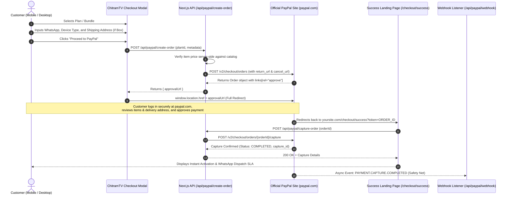

# PayPal Full-Redirect & Refund Architecture Plan

> **Status:** PENDING CLIENT ASSETS (14-Day Information Gathering Window)  
> **Target System:** ChitramTV UK (`uk-streaming-client`)  
> **API Version:** PayPal REST API v2 (`Orders v2` & `Payments v2`)  
> **Environment Target:** Sandbox $\rightarrow$ Production Verification  

---

## 1. Context & Executive Overview

Following initial client delivery and mentor consultation, development on live payment integrations is temporarily paused for a **14-day holding period** while the client gathers necessary business information, legal entity verifications, and PayPal production credentials.

This document establishes the strategic, architecture-first blueprint for transitioning the checkout flow to a **Server-Driven Full PayPal Redirect** and executing an exhaustive Sandbox testing matrix (including capture, refunds, and webhooks) before going live.

---

## 2. Architectural Decision: Orders v2 vs. Subscriptions

### Decision: **Standardize Exclusively on PayPal Orders v2 (`intent: "CAPTURE"`)**

### Rationale:
1. **Hybrid Catalog (Hardware + Digital Passes):**
   * ChitramTV sells both digital access passes (1-Month Pass, 14-Month Pass, Renewal Top-Ups) and **Physical Equipment** (*ChitramTV Black Edition C1 Box* bundled with service, delivered by tracked UK courier).
   * PayPal Subscriptions (`/v1/billing/subscriptions`) is restricted to automated recurring software billing and cannot natively accommodate physical box orders, courier shipping addresses, or upfront one-year hardware bundles.
2. **Fixed Non-Renewing Passes:**
   * IPTV customers typically prefer fixed-term passes over auto-renewing credit card charges.
3. **Unified Order Management & Single Refund Pipeline:**
   * Orders v2 provides a single unified flow where digital passes and physical boxes use the exact same capture and refund API (`/v2/payments/captures/{capture_id}/refund`).

---

## 3. The Full Redirect User Experience Flow

Rather than relying on client-side JavaScript popup modals (which can be blocked by mobile browsers or cause UX drop-offs), the checkout operates via a **Server-Driven Hosted Redirect**:



### Key Technical Attributes of the Redirect Flow:
* **Pre-Checkout Capture:** WhatsApp number, streaming device type (Firestick, Android TV, Smart TV), and physical delivery addresses are recorded in your application state *before* redirecting to PayPal.
* **Return URL:** `https://chitramtv.co.uk/checkout/success?token={order_id}`
* **Cancel URL:** `https://chitramtv.co.uk/checkout/cancelled` (smooth fallback returning the user to their cart without state loss).

---

## 4. Sandbox Testing & Refund Verification Matrix

In accordance with best practices, **100% of functional flows—including refunds—must be proven in Sandbox** prior to touching the live account.

### 4.1 Prerequisites (Developer Dashboard)
* **Sandbox Business Account:** Simulates Shiva Technology Ltd merchant profile (receives GBP £).
* **Sandbox Personal Account:** Simulates UK customer (pre-funded with mock £ balance and fake test cards).

### 4.2 Test Scenarios & Verification Criteria

| Test ID | Scenario | Expected Behavior | Verification Point |
| :--- | :--- | :--- | :--- |
| **TEST-01** | Full Digital Pass Checkout | Redirects to PayPal, buyer approves, redirects to `/checkout/success`, captures order. | Status: `COMPLETED`, balance credited to sandbox merchant. |
| **TEST-02** | Hardware Bundle Checkout | Passes item breakdown and shipping requirement to PayPal. Customer approves address. | PayPal Order contains shipping address; status `COMPLETED`. |
| **TEST-03** | User Cancellation | Customer clicks "Cancel and return to Shiva Technology Ltd" on PayPal. | Redirects to `/checkout/cancelled`, session restored, zero charge. |
| **TEST-04** | Simulated Card Decline | Sandbox test instrument triggers `INSTRUMENT_DECLINED`. | Frontend displays actionable error prompt to try alternative payment. |
| **TEST-05** | **Sandbox Refund Execution** | Server initiates `POST /v2/payments/captures/{capture_id}/refund` for full order amount. | Capture status changes to `REFUNDED`; money restored to sandbox buyer. |
| **TEST-06** | **Partial Refund Execution** | Issue partial refund (e.g. £10 goodwill discount on bundle). | Capture status changes to `PARTIALLY_REFUNDED`. |
| **TEST-07** | Webhook Redundancy | Customer approves on PayPal but forcibly closes browser tab before redirect loads. | `PAYMENT.CAPTURE.COMPLETED` webhook fires and auto-provisions streaming access. |

---

## 5. Transition to Live Production (The Sanity Check)

Once the 14-day holding period concludes and all Sandbox criteria are validated:

1. **Environment Switch:**
   ```env
   PAYPAL_ENVIRONMENT=production
   PAYPAL_CLIENT_ID=live_client_id_from_client
   PAYPAL_CLIENT_SECRET=live_client_secret_from_client
   NEXT_PUBLIC_APP_URL=https://chitramtv.co.uk
   ```
2. **Real-Money Micro Test (£1.00):**
   * Configure a temporary live test SKU (£1.00) or test with an actual 1-month pass.
   * Conduct an authentic purchase using a personal UK debit card.
   * Verify funds reach Shiva Technology Ltd's real PayPal merchant balance.
3. **Live Refund Verification:**
   * Execute a refund through the PayPal API/Dashboard on the £1.00 live transaction.
   * Confirm that the cardholder receives the refund confirmation email and bank credit.

---

## 6. Client Information Checklist (To Finalize After 14 Days)

Before running the live deployment, confirm receipt of the following details from the client:
- [ ] Active PayPal UK Business Account in the legal name of *Shiva Technology Ltd*.
- [ ] Live REST App credentials (`Client ID` and `Client Secret`) from `developer.paypal.com`.
- [ ] Primary customer support email address and verified helpline for customer PayPal receipts.
- [ ] Registered business address matching UK Companies House documentation.
- [ ] Production webhook endpoint registered with `PAYMENT.CAPTURE.COMPLETED` and `PAYMENT.CAPTURE.REFUNDED` events.
